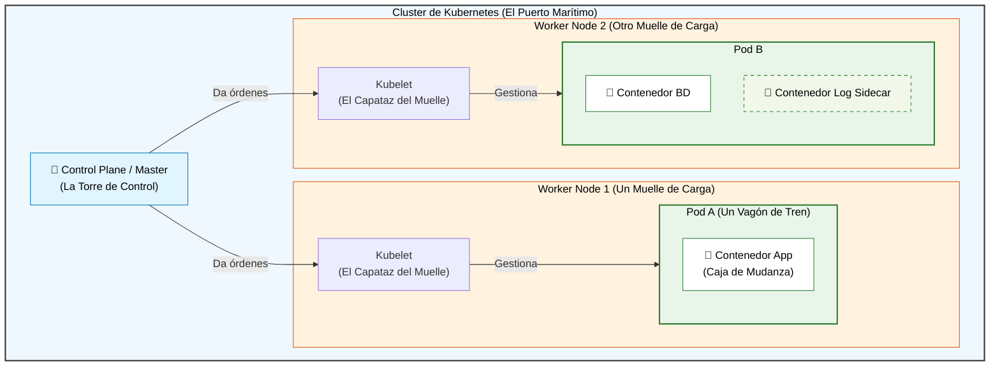
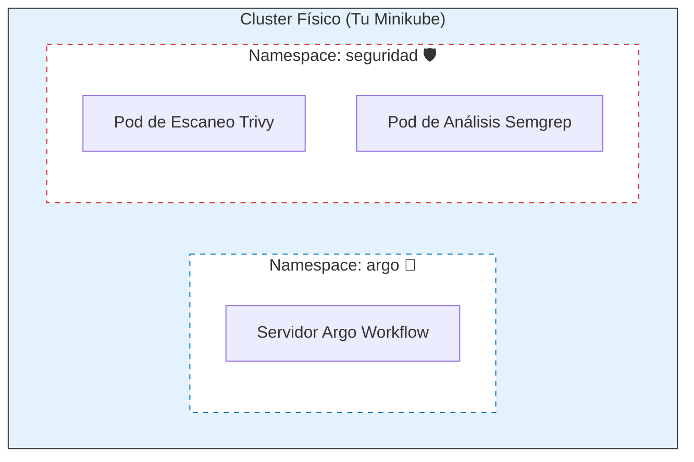

# Introducción a Cloud Native: De Docker a Kubernetes

Bienvenido al mundo del desarrollo moderno. Antes de sumergirnos en el laboratorio de seguridad, necesitamos entender las piezas fundamentales sobre las que se ejecuta nuestra infraestructura.

Vamos a usar una analogía: **Un puerto de carga marítimo internacional.**

## El Diagrama "Big Picture"

Este diagrama resume cómo se relacionan todos los componentes que vamos a ver. Mantenlo en mente mientras leemos las definiciones.

#  1. Docker (El Contenedor Estándar)
El problema que resuelve: "¡En mi máquina funcionaba!"

Antiguamente, si querías ejecutar una aplicación, tenías que configurar el servidor, instalar la versión exacta de Java/NodeJS, las librerías correctas, etc. Era como intentar mover una casa entera con todos sus muebles sueltos.

¿Qué es Docker? Docker nos permite empaquetar la aplicación junto con todo lo que necesita para ejecutarse (código, librerías, entorno) en un paquete estandarizado.

🚢 La Analogía: Docker es como un contenedor de transporte marítimo estándar. No importa si lleva coches o plátanos; la grúa del puerto lo maneja exactamente igual porque tiene medidas estándar.

En el diagrama: Son las cajas blancas dentro de los Pods (🐳).

#  2. Kubernetes / K8s (El Orquestador)
El problema que resuelve: Docker es genial para un solo contenedor. Pero, ¿qué pasa si tienes 500 contenedores? ¿Qué pasa si un servidor se rompe? ¿Cómo se comunican entre ellos de forma segura?

¿Qué es Kubernetes? Es un "orquestador". Es un software que gestiona un clúster (un grupo) de servidores para ejecutar tus contenedores de Docker de forma eficiente, escalable y resiliente. Si un contenedor muere, K8s lo revive. Si hay mucho tráfico, K8s crea más copias.

🏭 La Analogía: Kubernetes es la Autoridad Portuaria y la Torre de Control. Decide en qué muelle (servidor) se coloca cada contenedor, se asegura de que los barcos no choquen y garantiza que la carga llegue a su destino.

En el diagrama: Es todo el recuadro azul grande y la Torre de Control (🧠).

Nota: En este laboratorio usamos Minikube, que es una versión miniatura de un puerto entero que cabe en tu laptop.

#  3. Pods (La Unidad Atómica)
El concepto clave: Kubernetes NO gestiona contenedores directamente. Gestiona Pods.

¿Qué es un Pod? Es la unidad más pequeña que puedes desplegar en Kubernetes. Es un envoltorio que suele contener un solo contenedor principal (tu app).

A veces, un Pod puede tener "contenedores ayudantes" (sidecars) que necesitan vivir pegados al contenedor principal, compartiendo la misma dirección IP y los mismos discos.

🚃 La Analogía: Piensa en un Pod como un vagón de tren.

Generalmente, un vagón lleva una sola gran caja de carga (tu contenedor de Docker).

Pero a veces, en el mismo vagón, puede ir una pequeña caja de herramientas de mantenimiento pegada a la carga principal. Ambos viajan juntos y comparten el mismo espacio.

En el diagrama: Son los recuadros verdes (vagones) que envuelven a los contenedores (📦).

#  4. Namespaces (Espacios de Nombres)
El problema que resuelve: Imagina que en nuestro puerto gigante trabajan dos empresas rivales, o el equipo de "Desarrollo" y el de "Producción". No queremos que el equipo de Desarrollo borre accidentalmente los contenedores de Producción.

¿Qué es un Namespace? Es una forma de dividir virtualmente un clúster físico en múltiples "clústeres virtuales". Proporciona aislamiento y organización.

🗄️ La Analogía: Son como carpetas en tu disco duro. Tienes un solo disco físico, pero guardas tus fotos en una carpeta y tus documentos de trabajo en otra para no mezclarlos. O, en el puerto, son zonas reservadas para clientes específicos.

En nuestro laboratorio: Usamos el namespace argo para las herramientas de gestión y el namespace seguridad para ejecutar tus escaneos.

