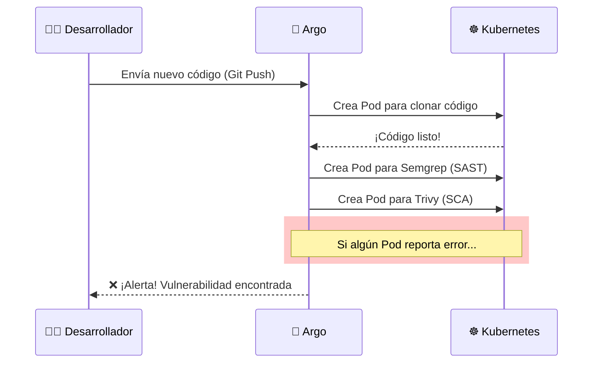

# 🛠️ Las Herramientas del Laboratorio

Ya entendemos el puerto (Kubernetes) y los contenedores (Docker). Ahora, conozcamos a los "trabajadores" especializados que viven dentro de nuestro clúster y nos ayudan a asegurar el software.

## 1. Minikube (El Puerto Portátil)
Como no todos tenemos un presupuesto de miles de dólares para rentar servidores en la nube (AWS/Azure), usamos Minikube.

* **¿Qué es?** Es una versión completa de Kubernetes diseñada para ejecutarse en una sola computadora (tu laptop).
* **Su función:** Crea una máquina virtual (o un contenedor grande) que simula ser un clúster de nodos.
* **Analogía:** Es como tener una maqueta funcional del puerto dentro de una botella. Hace todo lo que hace el puerto real, pero a escala pequeña.

---

## 2. Argo Workflows (El Coordinador Logístico)

En DevOps, necesitamos automatizar pasos: *Descargar código -> Probar -> Escanear -> Desplegar*.

* **¿Qué es?** Es un motor de flujos de trabajo diseñado específicamente para Kubernetes. A diferencia de Jenkins (que suele ser un servidor externo), Argo vive **dentro** del clúster.
* **Su función:** Lee nuestro archivo `pipeline.yaml` y crea Pods para ejecutar cada paso. Si el paso "Escanear" falla, Argo detiene el proceso y nos avisa.
* **Analogía:** Es el **Jefe de Logística** con una lista de verificación (checklist). Él grita: *"¡Paso 1 completado! ¡Traigan el equipo del Paso 2!"*.


##  3. Semgrep (El Inspector de Planos - SAST)
SAST significa Static Application Security Testing (Pruebas de Seguridad de Aplicación Estática).

* **¿Qué es?** Una herramienta que lee tu código fuente (texto) buscando patrones peligrosos antes de que la aplicación siquiera se ejecute.

Su función: Busca cosas como contraseñas escritas en el código (password = "12345"), funciones peligrosas (eval()) o falta de validaciones.

* **Analogía:** Es como un Arquitecto revisando los planos de una casa antes de construirla. Busca errores de diseño: "Oye, pusiste la puerta del baño transparente" o "Esta pared no soportará el techo".

Ojo: Semgrep no ejecuta el código, solo lo lee.

## 4. Trivy (El Inspector de Materiales - SCA)
SCA significa Software Composition Analysis (Análisis de Composición de Software).

* **¿Qué es?** Una herramienta que analiza todo lo que tú NO escribiste: las librerías de terceros y el sistema base del contenedor.

Su función: Tú escribiste 100 líneas de código, pero importaste una librería (node_modules) que tiene 10,000 líneas. Trivy revisa si esas librerías tienen vulnerabilidades conocidas (CVEs). También revisa si el sistema operativo del contenedor (ej. Alpine Linux) es seguro.

* **Analogía:** Es el Inspector de Calidad de Materiales. Tú diseñaste la casa bien (Semgrep está feliz), pero Trivy llega y dice: "Cuidado, el cemento que compraste (librería externa) caducó en 2019 y los ladrillos tienen plomo".

🆚 Resumen Visual: ¿Qué escanea quién?
Para no confundirnos, aquí está la diferencia clave entre Semgrep y Trivy en nuestro pipeline:

```mermaid
graph LR
    subgraph APP [Tu Aplicación]
        Code[📝 Tu Código Fuente]
        Libs[📚 Librerías (NPM/Pip)]
        OS[🐧 Sistema Operativo Base]
    end

    Code -->|Analizado por| SAST(🔍 Semgrep)
    Libs -->|Analizado por| SCA(📦 Trivy)
    OS -->|Analizado por| SCA

    style SAST fill:#ffecb3,stroke:#ff6f00,stroke-width:2px
    style SCA fill:#b3e5fc,stroke:#01579b,stroke-width:2px

``` 
**Regla de oro:**

* Si el error lo cometiste tú al escribir -> Semgrep.
* Si el error viene en algo que descargaste -> Trivy.